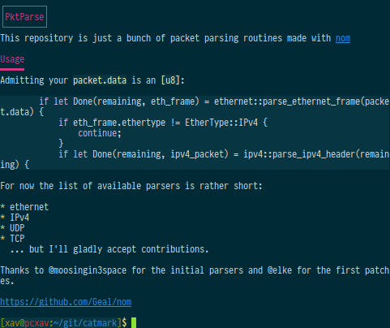

# CatMark - Markdown(CommonMark) printer for the terminal

## What's that ?

CatMark is a Markdown (following the CommonMark spec) printer for the terminal. It parses your README.md and displays it with color ANSI sequences - it works in your regular Linux/MacOSX terminal, and should even work under Windows 10's terminal (untested though).
Embedded source code is syntax-highlighted according to the source-type tag.
CatMark is written in Rust, so it's a regular binary that has no runtime dependencies, and should be quite fast.

## Caveats

The only problem is that it's largely unfinished for now:
- line breaks aren't pretty
- links and footnotes aren't displayed very well
- images have only their title and link displayed
- tables are not recognized at all and will be very ugly
- the code in general is ugly and will probably panic on some of your files
- I've written that largely for fun and I'm not sure I'll finish it one day

